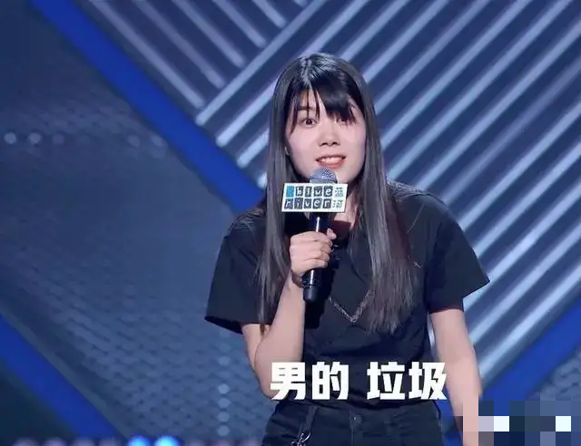
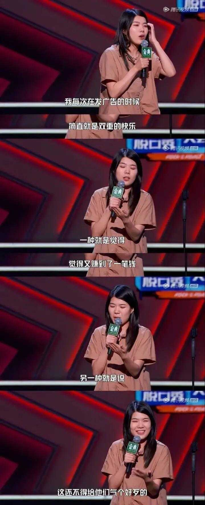
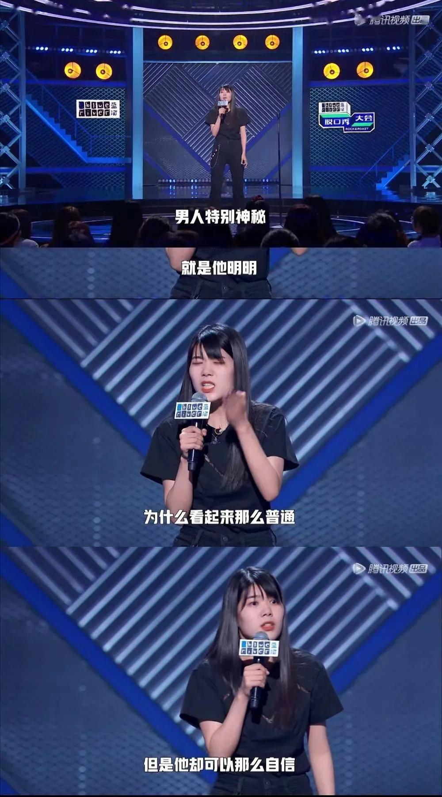
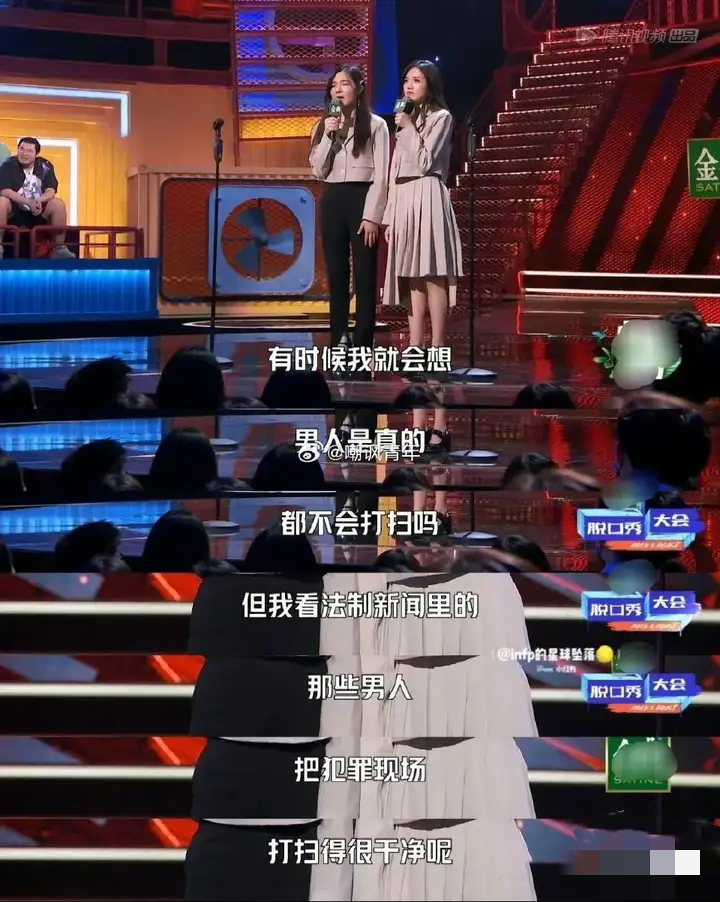
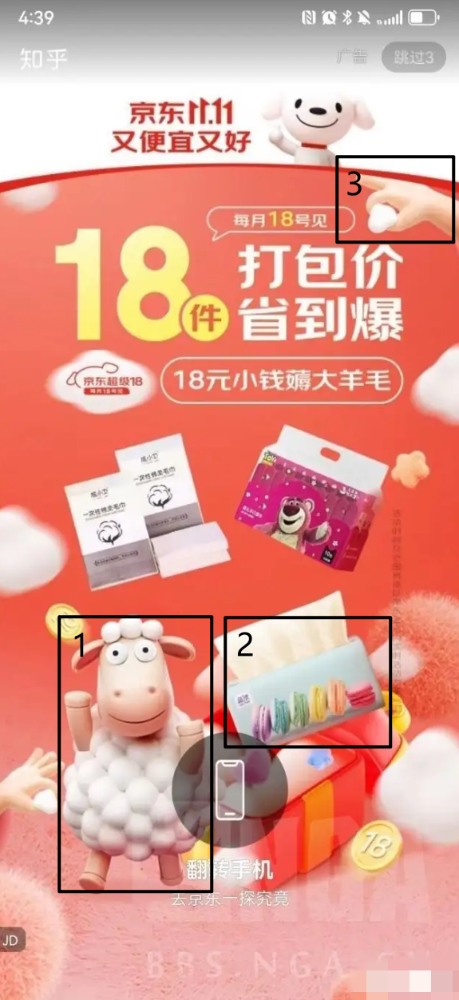

# 京东杨笠事件
> ### 仅就公开信息进行整合。  
### 提交PR请附带相应截图/视频/链接进行佐证。  

  
  

## 一. 背景知识
### 杨笠是谁
脱口秀演员。2017年开始进入脱口秀行业，前期表现普通。2020年在《脱口秀大会第三季》中，因嘲讽男性  
**“明明那么普通，却那么自信”**  
而爆火。而后其脱口秀内容开始大量涉及对男性群体的侮辱，或者挑拨男女对立制造流量。其著名言论还包括：  
**“男的，垃圾”**、  
**“男人还有底线呢？”**  
等等，被大量女性视作“女权领袖”。[【链接】](https://zh.wikipedia.org/zh-cn/%E6%9D%A8%E7%AC%A0?oldformat=true#%E4%BA%89%E8%AE%AE)

  
  

  
  

### 颜怡颜悦是谁
脱口秀组合，双胞胎姐妹。2019年参加《脱口秀大会第二季》，前期内容正常。后期，在杨笠爆火之后，内容开始逐渐转向“女权主义”，开始逐渐包含更多侮辱男性群体的内容。

## 二. 时间线
### 2024-10-14：京东官宣杨笠
1. 京东发布微博官宣杨笠，引发男性用户反感。[【截图】](./img/京东/官宣杨笠.png)
1. 少量京东男性用户开始退“京东Plus”会员。
1. 京东关闭评论区。

### 2024-10-15：京东官宣颜怡颜悦
1. 京东发布微博官宣颜怡颜悦。[【截图】](./img/京东/颜怡颜悦.png)
1. 进一步激起男性用户不满，舆论持续发酵。

### 2024-10-16：京东删除官宣微博
1. 更多男性用户开始退“京东Plus”会员，并开始以打差评、开发票、注销京东账号等方式表示不满。[【截图】](./img/反制/注销.webp)
1. NGA论坛用户开始陆续从京东金融提现。[【截图-待添加】]()

### 2024-10-17：京东客服微博挂人，给收件人打电话
1. 京东客服在微博挂人并辱骂退“京东Plus”会员的用户。[【截图】](./img/客服泄露隐私/客服微博挂人.png)
1. 京东客服给开发票订单的收件人打电话告知。[【截图】](./img/客服泄露隐私/开发票给收件人打电话.png) [【截图】](./img/客服泄露隐私/开发票.png)
1. 京东平台开始屏蔽“杨笠”，“普信”等字眼。包含这些字眼的差评不会通过，好评会被屏蔽变成星号 `*`。[【截图】](./img/京东/屏蔽关键词.png)
1. 京东营销策划在知乎发言再次嘲讽男性。[【截图】](./img/京东/京东策划知乎发言.png)
1. 京东未就客服挂人事件进行回应。
1. NGA论坛用户发布著名的“十九条”用以反制京东未来可能的公关策略。[【十九条】](./img/反制/十九条.png) [【十九条图片版】](./img/反制/十九条图片版.png)

### 2024-10-18：京东道歉
1. 京东发布微博道歉，京东金融转发并配“家人们”。[【京东道歉】](./img/京东/道歉.png)  [【京东金融转发】](./img/京东金融/家人们微博.png)
1. “京东金融挤兑”登上微博热搜，后被火速撤下。[【截图1】](./img/京东金融/挤兑热搜-1.png) [【截图2】](./img/京东金融/挤兑热搜-2.png)
1. 京东金融给用户群发短信“家人们”。[【截图】](./img/京东金融/短信.png)
1. 京东金融称已就“挤兑”谣言报警。[【截图】](./img/京东金融/报警.png)
1. 网友与之前京东惹怒女性用户时的道歉声明做对比，指出该道歉声明极其敷衍。[【18年道歉】](./img/京东/18年道歉.png)
1. NGA论坛用户发布京东金融App内巨额赎回截图，引发恐慌。[【截图】](./img/反制/nga巨额赎回.png)
1. 京东金融用户发现，提款时的打款方变成了“兴业T0流动性支持”。[【截图1】](./img/京东金融/兴业银行-1.png) [【截图2】](./img/京东金融/兴业银行-2.png)

### 2024-10-19 至 2024-10-22：混乱阶段
> 下述情况具体发生时间查证困难，时间线非常混乱。基本上是所有情况一起发生。

#### 1. 京东疑似临时取消客服差评考核，开始出现大量京东客服辱骂用户事件。

#### 2. 京东开屏广告疑似夹带私货、内涵用户。

  
  <ul>
    <li>1. “羊立”被怀疑指代“杨笠”。</li>
    <li>2. 六种颜色排列被指与<a href="img//开屏广告/旗帜.png" target="_blank"> LGBT 旗帜 </a>完全一致。</li>
    <li>3. 手势被指为<a href="img//开屏广告/手势.png" target="_blank">韩国极端女权组织的辱男手势</a>。</li>
  </ul>

  
  <ul>
    <li>1. “羊立”被怀疑指代“杨笠”。</li>
    <li>2. 手势被指为<a href="img//开屏广告/手势.png" target="_blank">韩国极端女权组织的辱男手势</a>。</li>
    <li>3. 集齐了<a href="img//开屏广告/旗帜.png" target="_blank"> LGBT 旗帜 </a>的全部六种颜色（红橙黄绿蓝紫，蓝色在手表上）。</li>
  </ul>

  
  <ul>
    <li>《女人的胜利》</li>
  </ul>

  
  <ul>
    <li>被质疑为“面向用户打拳”</li>
  </ul>

#### 3. 京东金融用户发现，提款时打款方出现其他银行。
- 平安 [【截图】](./img/京东金融/平安银行.png)
- 盛京 [【截图】](./img/京东金融/盛京银行.png)

#### 4. 京东被发现给快递员降薪三次，同时办公室员工大幅涨薪。
1. [【降薪-1】](./img/薪资/快递员降薪三次-1.png) 
2. [【降薪-2】](./img/薪资/快递员降薪三次-2.png)
3. [【涨薪】](./img/薪资/京东加薪.png)

#### 5. 此前京东“她力量”文章被再次翻出，女性员工比例达 46%，同时快递员及技术岗位男性占比高。
1. [【京东她力量】](./img/京东/京东她力量.png)
1. [【京东金融她力量】](./img/京东金融/她力量.png)

#### 6. 网友向美国证监会、香港证监会等机构投诉京东未按要求披露舆论情况。
1. [【称向港交所投诉】](./img/反制/港交所投诉.png)

#### 7. NGA论坛声讨京东的帖子被全部删除 [【截图】](./img/京东/nga锁定.png)

#### 8. B站Up主“戏京同志”，“章北海Official”被网友发现疑似为京东洗地，被强烈抵制。两个Up主均已删除相关视频。

### 2024-10-22：摩根大通维持京东“买入”评级，京东美股当日收盘上涨2.2%。
- [【摩根大通评级】](./img/京东/摩根大通评级.png)
- [【股价走势】](./img/京东/股价.png)

### 2024-10-24：京东B站商单被抵制；用户称京东金融阻止账户注销；网传京东“撤稿函”
1. 10/23深夜至10/24凌晨，大量B站Up主同时发送京东红包动态，被用户强烈抵制，多数Up主已删除并道歉。
  - [【知乎问题】](./img/京东/b站商单.png)
  - [【发布京东红包动态Up主名单】](https://www.zhihu.com/question/1859720980/answer/13350283685)
  - [【B站视频】](./img/京东/b站视频.mp4)
1. 有用户爆出，京东金融通过给用户账户增加`0.xx`元余额来阻止用户注销账户。
  - [【知乎问题】](./img/京东金融/阻止注销-1.png)
  - [【银行到账截图】](./img/京东金融/阻止注销-2.png)
  - [【京东金融app截图】](./img/京东金融/阻止注销-3.png) 
1. 网上开始流出京东“撤稿函”，但由于函件格式不规范，行文水平低，以及最后结尾有两个句号，被怀疑并非出自京东官方。
  - [【撤稿函】](./img/京东/撤稿函.jpg)

### 2024-10-27：B站Up主“HT大神”说明“撤稿函”来源。
- B站Up主“HT大神”发视频，说明该“撤稿函”来源为他的视频被下架时的B站附件。 [【HT大神视频】](https://www.bilibili.com/video/BV1nK1hYgEuJ)
- B站Up主“HT大神”与Up主“唯一讲述者”直播连麦，现场展示“撤稿函”来源。[【HT大神连麦唯一讲述者直播录屏】](https://www.bilibili.com/video/BV16T1YYjEsR)
- “撤稿函”在直播中被认证极大概率就是来自京东官方。

## 三. 过去曾与杨笠合作的其他品牌
1. 小鹏汽车
2. 舍得酒
3. 英特尔
4. 海澜之家
5. ...（更多-待添加）

## 四. 相关事件
1. 胖猫事件
2. 追风小叶
3. ...（更多-待添加）

